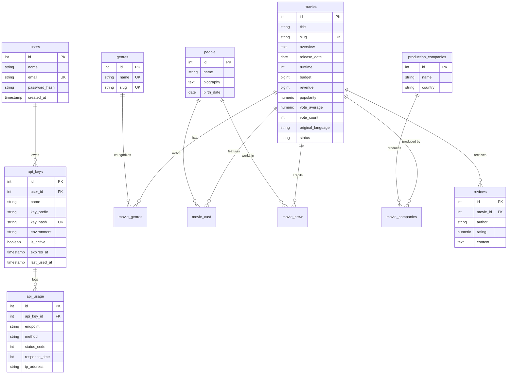
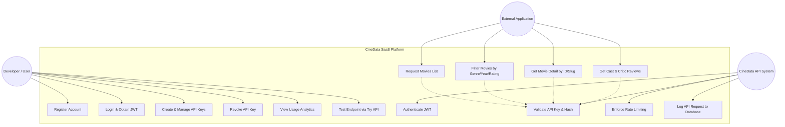
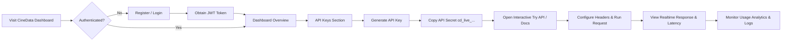
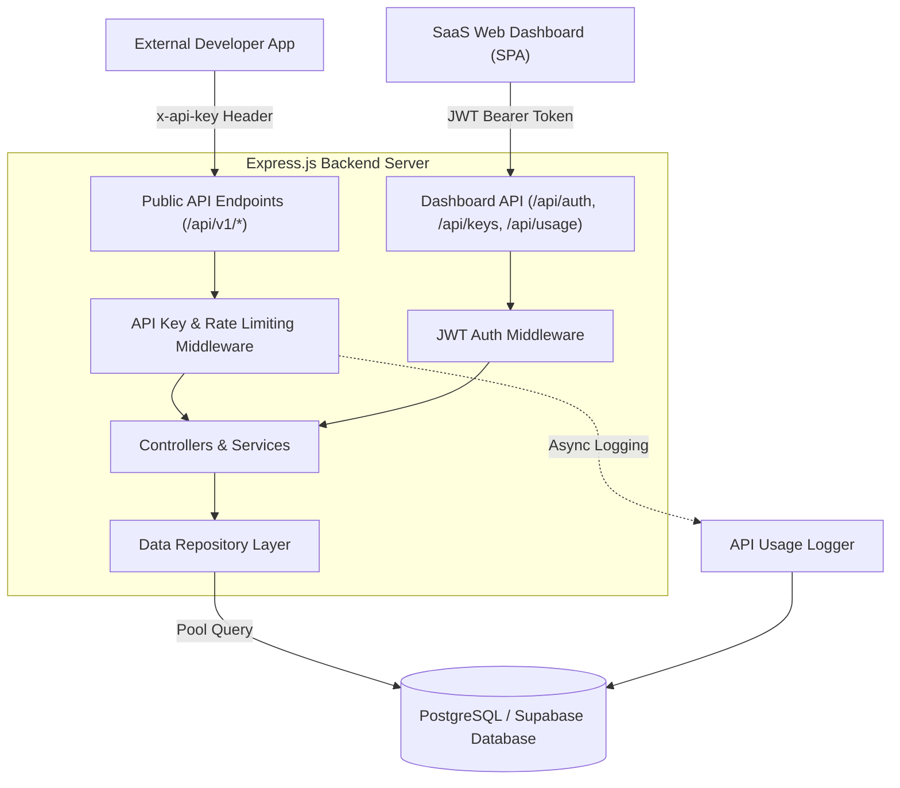

# CineData API System Diagrams & Academic Documentation

This document contains the visual architecture, ERD, Use Case, Activity Diagram, and User Flow specifications for **CineData API**.

---

## 1. Entity Relationship Diagram (ERD)



---

## 2. Use Case Diagram



---

## 3. Activity Diagram (API Request Lifecycle)

```mermaid
stateDiagram-v2
    [*] --> ReceiveRequest: Client sends HTTP request with x-api-key
    ReceiveRequest --> ExtractHeader: Read x-api-key header
    ExtractHeader --> CheckHeaderExist{Key Header Present?}

    CheckHeaderExist --> |No| ErrMissingKey: Return 401 MISSING_API_KEY
    CheckHeaderExist --> |Yes| HashKey: Compute SHA-256 Hash of key

    HashKey --> QueryDbKey: Lookup key_hash in PostgreSQL / Supabase
    QueryDbKey --> CheckKeyFound{Key Record Exists?}

    CheckKeyFound --> |No| ErrInvalidKey: Return 401 INVALID_API_KEY
    CheckKeyFound --> |Yes| CheckActive{Is Key Active?}

    CheckActive --> |No| ErrInactiveKey: Return 403 INACTIVE_API_KEY
    CheckActive --> |Yes| CheckExpired{Has Key Expired?}

    CheckExpired --> |Yes| ErrExpiredKey: Return 401 EXPIRED_API_KEY
    CheckExpired --> |No| CheckRateLimit{Hourly Limit Exceeded?}

    CheckRateLimit --> |Yes| ErrRateLimit: Return 429 RATE_LIMIT_EXCEEDED
    CheckRateLimit --> |No| QueryMovieData: Execute Controller & PostgreSQL Query

    QueryMovieData --> UpdateLastUsed: Asynchronously update last_used_at
    UpdateLastUsed --> LogApiUsage: Insert log entry to api_usage table
    LogApiUsage --> ReturnJsonResponse: Return HTTP 200 OK + Standard JSON Payload

    ErrMissingKey --> [*]
    ErrInvalidKey --> [*]
    ErrInactiveKey --> [*]
    ErrExpiredKey --> [*]
    ErrRateLimit --> [*]
    ReturnJsonResponse --> [*]
```

---

## 4. User Flow



---

## 5. System Architecture Diagram


